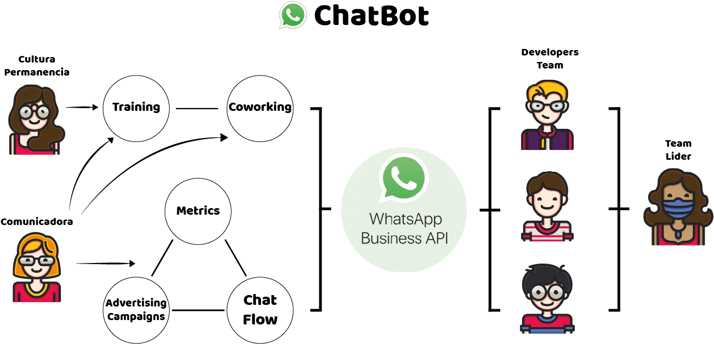
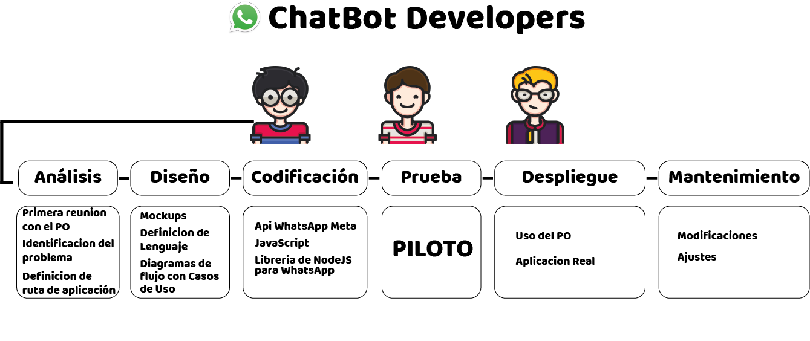
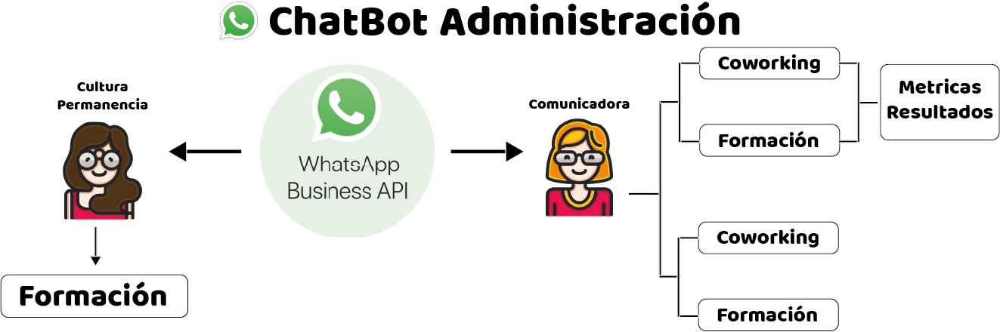
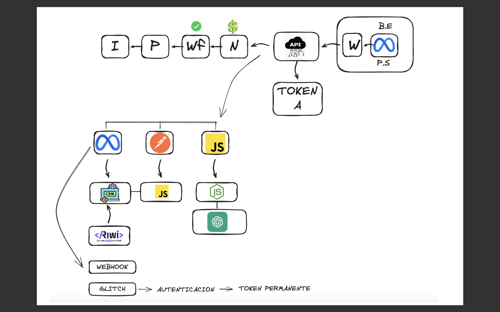
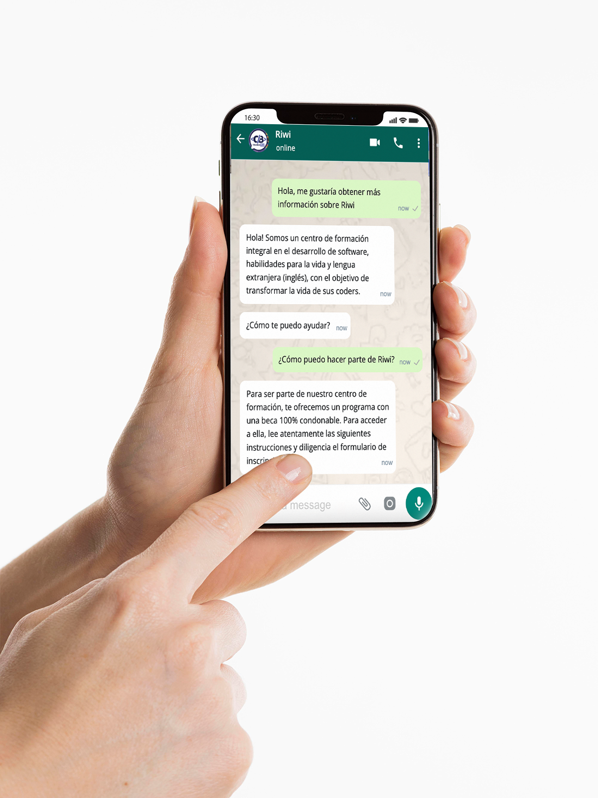

# -riwibot-
chatbot
<h1>Nombre del proyecto: RiwiBot</h1>

<b>Planteamiento del problema:</b> debido al crecimiento de Riwi como empresa y a su alta demanda de información, se ve en la necesidad de implementar un canal de comunicación optimizado que brinde respuestas oportunas y eficientes.

<b>Objetivo general:</b> automatizar procesos de comunicación entre Riwi con clientes potenciales (coworking y empresas), coders y futuros coders por medio de un chatbot en WhatsApp.

<b>Alcance del proyecto:</b>

<b>Corto plazo:</b>  chatbot general de Riwi.

<b>Objetivo:</b> desarrollar un chatbot que de respuestas al primer acercamiento que tienen los usuarios al solicitar información, reconociendo preguntas simples y generales.

<b>Metas:</b>

<ul>
    <li>Reunir al equipo de desarrollo con el cliente para establecer los requerimientos del proyecto.</li>
    <li>Elaborar  la documentación del proyecto.</li>
    <li>Adquirir los accesos y permisos necesarios (API)  desde Meta para implementar el código del chatbot.</li>
    <li>Desarrollar el código del chatbot.</li>
    <li>Incluir en el código un guión piloto para probar el chatbot.</li>
    <li>Vincular un número de prueba para realizar el piloto del proyecto.</li>
</ul>

<b>Mediano plazo:</b> chatbot de Riwi con ramificaciones.

<b>Objetivo:</b> ramificar las opciones de respuestas del chatbot según el tipo de usuario que solicite información: coworking y formación.

<b>Metas:</b>

<ul>
    <li>Establecer las diferentes opciones que se implementarán a la hora de ramificar las respuestas del chatbot.</li> <li>Coworking y formación: empresas, coders y aspirantes.</li>
    <li>Incluir en el código un guión con las respuestas para cada una de las ramas y subramas  del chatbot.</li>
    <li>Largo plazo: chatbot de Riwi con opciones de agendamientos y registros.</li>
</ul>

<b>Objetivo:</b> automatizar procesos de agendamientos y/o registros directamente desde el chatbot de WhatsApp según la necesidad del usuario.

<b>Metas:</b>

<ul>
    <li>Establecer las diferentes opciones de procesos que se implementarán en el chatbot según la necesidad del usuario: agendamientos y registros.</li> 
    <li>Incluir en el código las nuevas opciones de los procesos para agendar un espacio y/o registrarse según la necesidad del usuario.</li>
</ul>

<b>Actividades fuera del alcance:</b>

<ul>
    <li>Realizar la solicitud de la API de WhatsApp.</li>
    <li>Verificación de empresa por parte de Riwi.</li>
    <li>Realizar el pago para usar los servicios de la API de  WhatsApp.</li>
    <li>Redacción de las respuestas que se agregarán a las plantillas de la API de WhatsApp.</li>
    <li>CMR de los números de los estudiantes de Riwi.</li>
</ul>

<b>Requerimientos funcionales o historias de usuario:</b>

<ul>
    <li>Que al usuario iniciar una conversación por medio del chat de WhatsApp, el chatbot pueda mantener su flujo dando respuestas coherentes.</li>
    <li>Que al usuario solicitar información puntual, el chabot pueda responder a su solicitud de forma óptima.</li>
    Que el chatbot pueda identificar la solicitud del usuario y ramificarla según su categoría para brindarle una respuesta coherente.</li> 
    <li>Que el chatbot pueda identificar y realizar los procesos requeridos (agendar o registrar) según la solicitud del usuario.</li>
</ul>

<b>Roles:</b>

<ul>
    <li>Administrador: propietario del canal de WhatsApp encargado del número asociado al chatbot. Posee acceso a las métricas y a los chats.</li>
    <li>Usuario: es quien interactúa con el chatbot por medio del canal de WhatsApp.</li>
    <li>Equipo de desarrollo: posee acceso a la API con el objetivo de realizar entrenamientos al chatbot y garantizar su correcto funcionamiento.</li>
    <li>Placeholder: encargado de generar las indicaciones desde el área de comunicaciones para el chatbot (plantillas).</li> 
</ul>

<b>Tecnologías a implementar:</b>

<ul>
    <li>JavaScript.</li>
    <li>Librería de WhatsApp para Node.js</li>
    <li>Webhook URL (guía de ruta de la API).</li>
</ul>

<b>Etapas del proyecto (piloto):</b>

<ul>
    <li>Documentación y exploración (23-05).</li>
    <li>Implementación de modelo de desarrollo (24-05).</li>
    <li>Desarrollo (entregable)  - ciclo de vida de desarrollo (27-05).</li>
</ul>

<b>¿Qué servicios le vamos a entregar a Riwi?</b>

Un entregable como prueba piloto de la fase inicial del chatbot, que da respuestas al primer acercamiento que tienen los usuarios al solicitar información, reconociendo preguntas simples y generales.
 

<b>Fecha: 27-05</b>

<b>Actores y casos de uso - general:</b>

<b>Actores y casos de uso - desarrollo:</b>

<b>Actores y casos de uso - administración:</b>

<b>Stoppers:</b>

<ul>
    <li>Realizar la solicitud de la API de WhatsApp.</li>
    <li>Verificación de empresa por parte de Riwi.</li>
    <li>Realizar el pago para usar los servicios de la API de  WhatsApp.</li>
    <li>Redacción de las respuestas que se agregarán a las plantillas de la API de WhatsApp.</li> 
    <li>CMR de los números de los estudiantes de Riwi.</li>
</ul>

<b>Diagrama de flujo:</b>

<b>Mockup de cómo se vería nuestro chat:</b>

<b>Link del cronograma de actividades/tareas:</b>

<a href="https://trello.com/invite/b/wVKmEHUr/ATTIb20d801048176e66d8c542abe7a70d6eE9163A8D/chatbot-riwi">Tablero de Trello</a>
